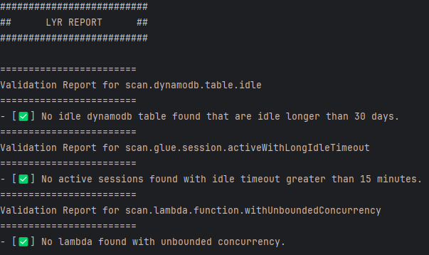

# Lyr

<p align="center">
Lyr is a CLI tool that analyzes cloud health and security across live environments and IaC artifacts, empowering developers with actionable insights delivered through both automation‑ready JSON reports and polished, human‑readable plain text or PDF summaries.
</p>

### Table of Contents

<!-- TOC -->
* [Lyr](#lyr)
    * [Table of Contents](#table-of-contents)
    * [Preview](#preview)
    * [Usage](#usage)
      * [Execution](#execution)
      * [Authentication](#authentication)
        * [Environment variable credential provider](#environment-variable-credential-provider)
        * [Profile credential provider](#profile-credential-provider)
    * [Installation](#installation)
      * [Steps to install pre-built jar](#steps-to-install-pre-built-jar)
      * [Steps to built it your self](#steps-to-built-it-your-self)
    * [Features](#features)
        * [Rules](#rules)
      * [Rule Set Configuration](#rule-set-configuration)
    * [Changelog](#changelog)
    * [Contributing](#contributing)
<!-- TOC -->

### Preview



### Usage

#### Execution

Lyr is being developed user in mind, if you have no preference you can simply run it with all default options like below:

```bash
java -jar lyr-0.2.0.jar scan-env aws
```

Or, if you are a power user and would like to configure the tool based on your needs you can provide all kinds of options

```bash
java -jar lyr-0.2.0.jar scan-env aws \
    --config "path/to/rule/set/config/file.yaml" \
    --profile "my-aws-profile" \
    --reportType "json" \
    --logLevel "off"
```

All available options can be found by running help function
```console
lyr@lyr:~$ java -jar lyr-0.2.0.jar scan-env aws --help
Usage: lyr scan-env aws [-hV] [-c=<arg0>] [-l=<arg3>] [-p=<arg2>] [-r=<arg1>]
Scans you aws environment using relative rulest and credentials
  -c, --config=<arg0>       Path to user rule set config file that specifies
                              the ruleset
  -h, --help                Show this help message and exit.
  -l, --logLevel=<arg3>     Desired level of details for logs
  -p, --profile=<arg2>      AWS profile that defines desired credential or
                              configuration to use
  -r, --reportType=<arg1>   Path to user config file that specifies the ruleset
  -V, --version             Print version information and exit.
```

See [sample custom rule set configuration](#rule-set-configuration) for details

#### Authentication

At this moment Lyr only works with 2 types of credential providers;
- Environment variable credential provider
- Profile credential provider

##### Environment variable credential provider

To provide credential through environment variables, [please follow this AWS documentation to set it up correctly](https://docs.aws.amazon.com/sdkref/latest/guide/environment-variables.html#envvars-set).

##### Profile credential provider

To provide credential through profiles, [please follow this AWS documentation to set it up correctly](https://docs.aws.amazon.com/cli/latest/userguide/cli-configure-files.html#cli-configure-files-using-profiles).

Or, for your local use you can simply run below command from aws cli to login with default profile.

```bash
aws login # Follow the login flow of aws cli
```

### Installation

> [!NOTE]
> While it's on the roadmap to create native images, at this time only using pre-built jar or building it yourself and using it are the available options.

#### Steps to install pre-built jar

- Download the preferred version of the jar from [releases].
- [Start using it](#usage)

#### Steps to built it your self

```bash
git clone https://github.com/izzettunc/lyr.git
cd lyr
mvn clean install 
# You will find your jar under the path lyr/lyr-core/target/shaded/
```

### Features

- Reporting in two format:
  - Human-readable plain text
  - Actionable JSON following the [report schema]
- Customizable rule sets allowing you to choose which rules to run

##### Rules
- Flag idle DynamoDB tables
- Flag active Glue sessions with long idle timeouts
- Flag lambda functions with unbounded concurrency
- Flag cloudwatch log groups without a retention policy

#### Rule Set Configuration

To see what kind of rules with what kind of configuration we run by default, you can check [default rule set].

A custom rule set can be created and provided as a configuration. Available rules and configuration can bee seen below.
```yaml
# Syntax:
# - scan.<service>.<resource>.<check>: <parameters>

scan.dynamodb.table.idle:
  maxIdlePeriodInDays: 180
  excludeEmptyTables: true

scan.glue.session.activeWithLongIdleTimeout:
  maxIdleTimeoutInMinutes: 15

scan.lambda.function.withUnboundedConcurrency:

scan.cloudwatch.logGroup.withoutRetentionPolicy:
```

### Changelog

Change log can be found for each release under releases or collected all together at [CHANGELOG page].

### Contributing

Before contributing please read the [DEVELOPMENT page] to better understand the expectations and what is the workflow.

[CHANGELOG page]: CHANGELOG.md
[DEVELOPMENT page]: doc/DEVELOPMENT.md
[default rule set]: lyr-core/src/main/resources/defaultRuleSet.yaml
[report schema]: doc/schema/lyr-json-report-schema-0.0.0.json
[releases]: https://github.com/izzettunc/lyr/releases