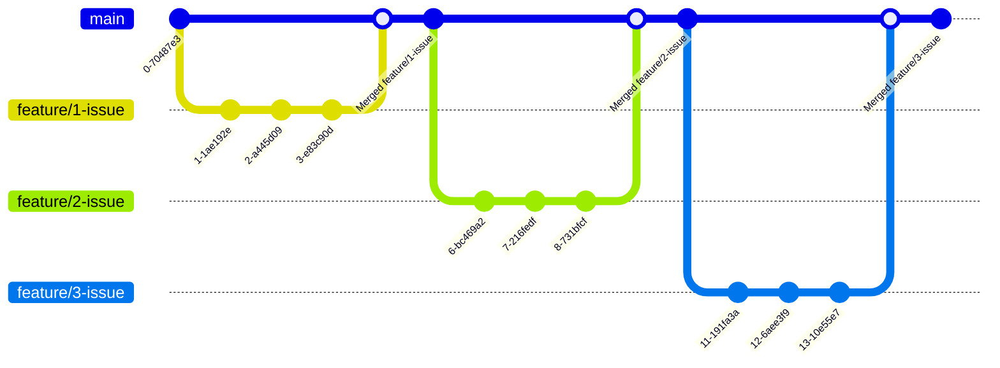

This document defines the conventions and workflow for contributing to Lyr, covering anything needed for a developer 
such as versioning, branching, releases, code quality, testing practices, and the expected quality standards.

## Table of Contents

<!-- TOC -->
  * [Table of Contents](#table-of-contents)
  * [Version](#version)
  * [Branching strategy](#branching-strategy)
    * [Type of branches](#type-of-branches)
    * [Workflow](#workflow)
  * [Release strategy](#release-strategy)
  * [Development workflow](#development-workflow)
    * [Clashes and or false positives](#clashes-and-or-false-positives)
    * [Testing](#testing)
      * [Unit tests](#unit-tests)
      * [Manual testing](#manual-testing)
<!-- TOC -->

## Version

Lyr project adheres to semantic versioning and is described on [semver docs] in detail.

## Branching strategy

Lyr project adheres to trunk based development as I am the only contributor at the moment and this strategy may change
as the number of contributors increase.

### Type of branches

- Feature branches that contains all the work for specific issue and act as a place for developer to stage their changes and later merged to main with a PR.
  - Syntax: `feature/<issue_number>-name-of-the-issue-that-in-kebab-case`
  - EG: `feature/123-add-authentication-process
- Main branch that represents always the latest state / release of the application

### Workflow

## Release strategy

Basically, each changes commit to main will be released and therefore it's cruicial to keep the version always up to date and correct.

## Development workflow

Lyr projects contains couple of SAST, to ensure the quality and correctness of the application. 
Currently present analyzers are Spotless, Checkstyle, PMD and SpotBugs. It's highly recommended to split your quality
checks and run the often. Following workflow is the one that I follow and it can be used as a starting point to create
your own.

1. Start development
2. Run `mvn spotless:apply checkstyle:check`
3. Fix any checkstyle issues
4. Run `mvn clean test`
5. Fix any test issue
6. Run `mvn spotless:apply checkstyle:check`
7. Fix any checkstyle issues
8. Run `mvn clean instal`
9. If there is any issues fix them and go to step 6 if not complete

### Clashes and or false positives

While automated analyzers are great they have also drawbacks. Clashes between them or false positives are two of them.
For this kind of issues it's acceptable to add exclusions in the projects but there should be always a valid reason and
last method to use. As all of these checks are there for a reason. If any exclusion is added there must also be a comment
around them to explain the reason.

### Testing

Testing is crucial for Lyr just like any other software project and there are usually two types of testing that is executed
which are unit tests and manual testing.

#### Unit tests

Unit tests are your usual unit tests in software development. Couple difference that may appear in Lyr is that the unit
tests are developed behavior in mind not the ranges of a function with that couple standards that are followd are:

- Name of the test case describes the behavior
- Test cases are consist of three stages;
  - Given: The step where you set the stage, data needed to run the test, expected data to validate the test, etc.
  - When: The step where the test runs, where the actions happens
  - Then: The step where the verification and assertions happen to see if the test has passed
- Test cases are split by Given, When, Then comments to clearly define the situation
- Expected coverage across all metrics (line, branch, etc) is 85% for the whole project.

#### Manual testing

While unit testing is the main strategy of testing, as of now due to pragmatic reasons it's not possible to keep it as
only method of testing. Due to that, after each issue it's recommended to build the project and run the actual tool to
verify the behavior and also a quick sanity check that nothing else is broken. The time spending on manual testing 
should be more and more thorough depending on test coverage on the packages that changed.

[semver docs]: https://semver.org/spec/v2.0.0.html

